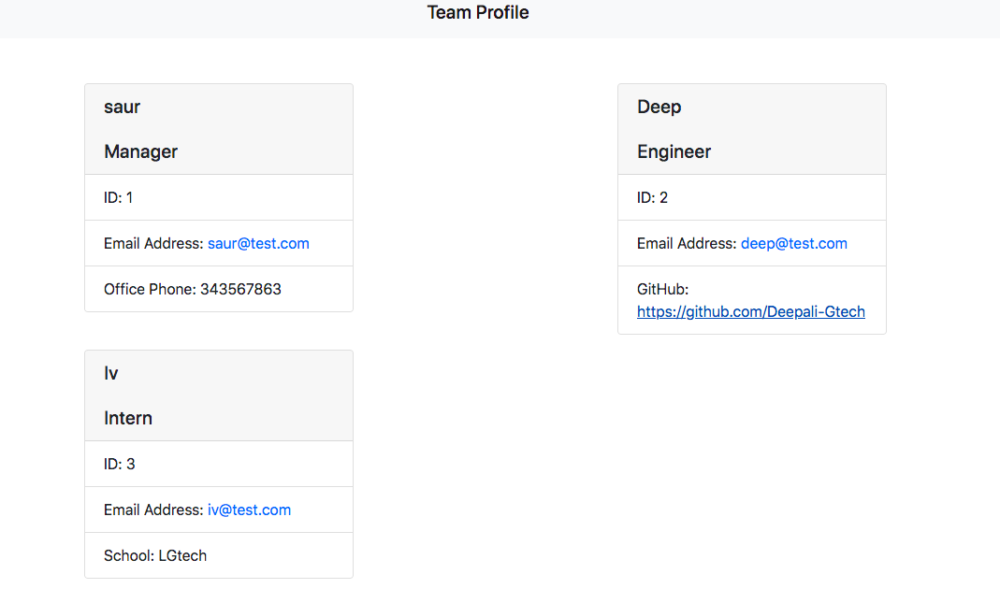
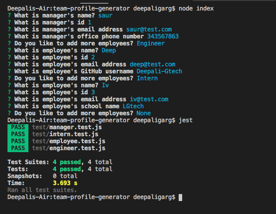

## License

# Team-Profile-Generator
This will build a Node.js command-line application that takes in information about employees on a software engineering team, then generates an HTML webpage that displays summaries for each person.

# walkthrough video link 
https://drive.google.com/file/d/149FhahB9uUric8w79i1KUT9N9bV6oCAb/view

## Below is the screen short for the generate html 

## Below is the screen short for terminal

## Technologies used
* Node.js

### Contact Detail 
Email-Id : deeapaligarg.chd@gmail.com

